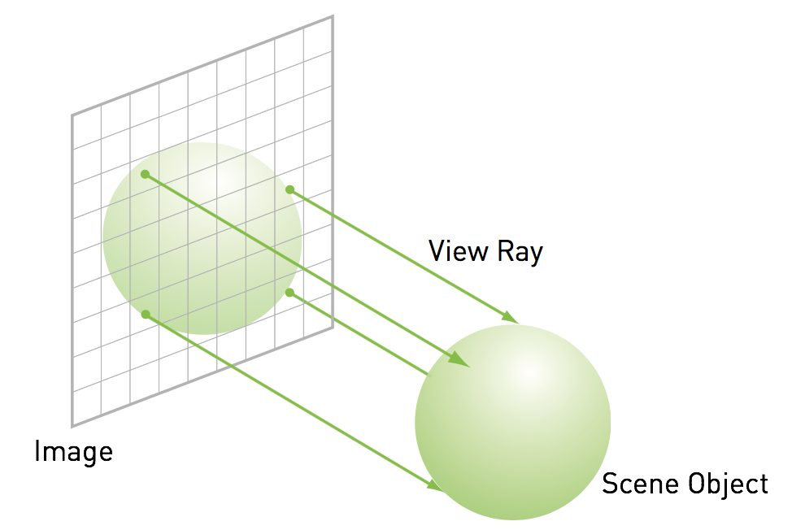

# HPC-lab
High Performance Computing laboratories combined.

## Lab 01
Modify the [mat_mult.cpp](lab01/mat_mult.cpp) file so that it contains a parallelised implementation of matrix multiplication. You need to fill in the `matrixMultParallel` function.

## Lab 02
Your task is to parallelize both compress and decompress functions, but mind the following:
1. Parallelization should be done inside the [dft.cpp](lab02/dft.cpp) file only. Do not parallelize the utilities.
1. Prepare two versions of `compress` parallelization. Do your best in the first one. In the second one just use the most naive atomic operations.
1. During decompression we require that only the master thread (`threadId == 0`) reads or writes the image data. You may still use other threads to compute sines / cosines values.
1. You may test your solution on the provided [example.bmp](lab02/example.bmp) bitmap or any other, but try to use similar dimensions.

## Lab 03
Implement the stencil operation on the CPU and GPU. 1D Stencil of radius `D > 1` is a function on a vector `X` to obtain a vector `Y` of the same size such that `Y[i] = X[i - D] + X[i - D + 1] + ... + X[i + D]`. Because `i - D` or `i + D` can exceed `X`'s length, you need to think how to solve this issue. In your kernel, have each thread handle one index. You can either use `threadIdx`, `blockIdx` or a combination of both.

Use the template in [lab03/stencil](lab03/stencil/).

## Lab 04
In this exercise your task is to optimise a GPU-based raytracer by using a different type of memory than the global memory. Raytracing is one way of rendering a 2D image of objects in a 3D space. Typically, GPUs do this in a process of rasterization. Raytracing is an alternative to that, but it's much more computationally intensive. The idea is simple - we place a camera in a scene and think of the final image as a digital sensor in that camera. Then we shoot rays for each pixel in the sensor (perpendicular to it and parallel to each other) and depending on the hit location, draw an appropriate color, like so:

Analyse the code in [lab04/raytrace/raytrace.cu](lab04/raytrace/raytrace.cu) and change it so it stores some of the data in one of the memory types mentioned in this lab. Compare the performance of the original version with your optimised version.
